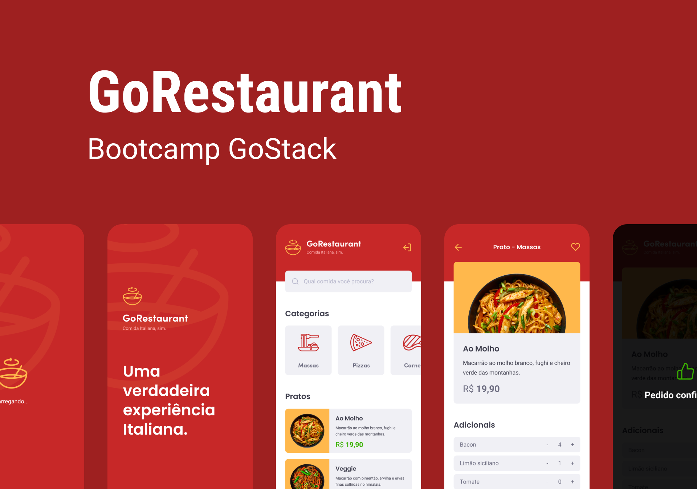

<h1>Desafio: GoRestaurant App Mobile</h1>

<h4>Esse repositório é referente ao décimo primeiro desafio do Bootcamp GoStack turma 12, oferecido pela <a href="https://rocketseat.com.br/">Rocketseat </a>.</h4>

Recebemos um template e o editamos para que atendesse aos requisitos propostos de interações com uma fake API através de um json-server

```Listar os pratos de comida da sua API:``` Sua página Dashboard deve ser capaz de exibir uma listagem, com o campo name, value e description de todos os pratos de comida que estão cadastrados na sua API.

```Listar as categorias da sua API:``` Sua página Dashboard deve ser capaz de exibir uma listagem, com o campo title e image_url de todas as categorias que estão cadastrados na sua API.

```Filtrar pratos de comida por busca ou por categorias:``` Em sua página Dashboard permitir que o input de pesquisa e os botões de categoria façam uma busca na API de acordo com o que estiver selecionado ou escrito no input.

```Listar os pedidos da sua API:``` Sua página Orders deve ser capaz de exibir uma listagem, com o campo as informações do produto pedido, com name e description de todos os pedidos que estão cadastrados na sua API.

```Listar os pratos favoritos da sua API:``` Sua página Favorites deve ser capaz de exibir uma listagem, com o campo as informações do produto favorito, com name e description de todos os pedidos que estão cadastrados na sua API.

```Realizar um pedido:``` Na sua página Dashboard, ao clicar em um item, você deve redirecionar o usuário para a página FoodDetails, onde será possível realizar um novo pedido, podendo controlar a quantidade desse item pedido, ou adicionar ingredientes extras. Todo o valor deve ser calculado de acordo com a quantidade pedida.

## Tecnologias Usadas
- TypeScript
- React Native
- react-native-masked-view
- React Navigation
- axios
- json-server
- polished
- styled-components
- Teste automatizados

Concluído no dia: **01/09/2020**
